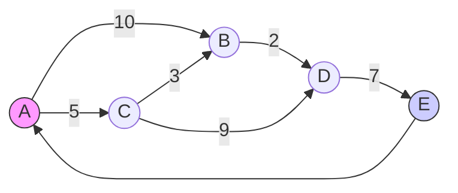
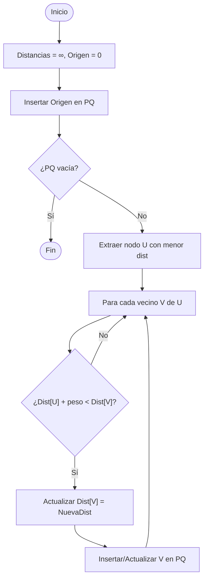
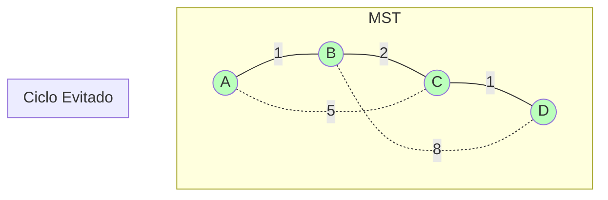
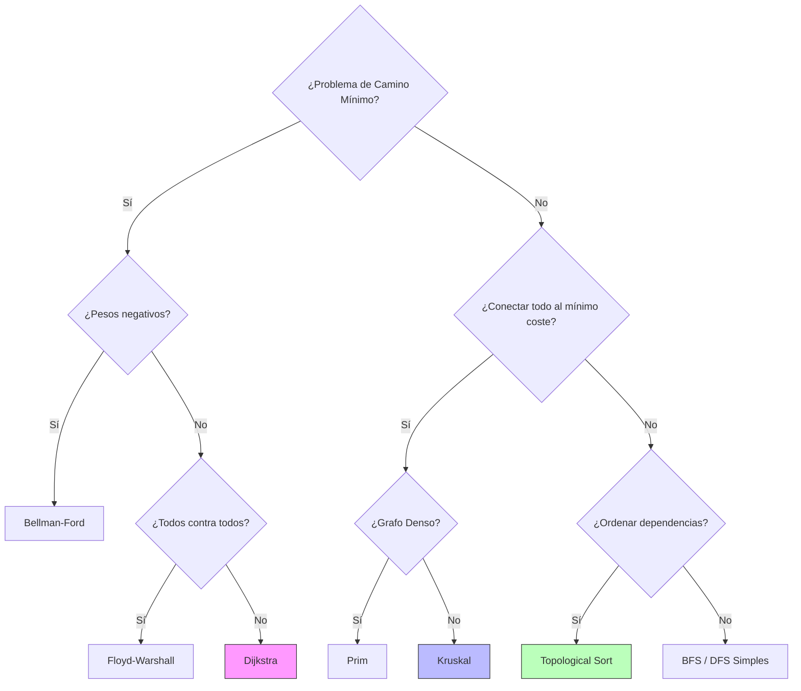

# Algoritmos sobre Grafos

> [!abstract] Objetivo
> Dominar los algoritmos fundamentales para el procesamiento de grafos: caminos mínimos (Dijkstra, Bellman-Ford), árboles de expansión mínima (Prim, Kruskal) y ordenamiento topológico. Entender la representación de grafos y su aplicación en problemas reales de redes.

![[Grafos_Visual_Summary.png]]

---

## 📊 Comparativa Rápida

| Algoritmo | Tipo | Complejidad | Mejor Para |
|-----------|------|-------------|------------|
| **Dijkstra** | Camino Mínimo | O(V + E log V) | Grafos pesados sin pesos negativos |
| **Bellman-Ford** | Camino Mínimo | O(V · E) | Grafos con pesos negativos |
| **Prim** | MST (Árbol Expansión) | O(E log V) | Grafos densos |
| **Kruskal** | MST (Árbol Expansión) | O(E log E) | Grafos dispersos (pocas aristas) |
| **Floyd-Warshall** | Todos los Caminos | O(V³) | Matrices densas, todos contra todos |
| **Topo Sort** | Ordenamiento | O(V + E) | Dependencias, DAGs |

---

## 1️⃣ Representación de Grafos

Antes de aplicar algoritmos, debemos representar el grafo en memoria.

### 📐 Tipos

1. **Matriz de Adyacencia**: Array 2D `M[i][j]` guarda el peso de la arista `i -> j`.
   - ✅ O(1) consultar si existe arista.
   - ❌ O(V²) espacio (malo para grafos dispersos).
2. **Lista de Adyacencia**: Diccionario/Array donde `A[i]` contiene lista de vecinos `[(j, peso), ...]`.
   - ✅ O(V + E) espacio.
   - ❌ O(grado) consultar arista específica.

### 🧜‍♀️ Visualización Conceptual



---

## 2️⃣ Algoritmo de Dijkstra (Camino Más Corto)

### 🔍 Concepto

Encuentra el camino más corto desde un **nodo origen** a todos los demás nodos en un grafo ponderado (pesos positivos).

**Analogía**: Imagina verter agua en el nodo origen; el agua se expande por las tuberías (aristas) y llega antes a los nodos más cercanos (menor peso/resistencia).

### ⚙️ Funcionamiento

1. Asignar distancia 0 al origen y ∞ al resto.
2. Usar una **cola de prioridad** para explorar siempre el nodo más "cercano" no visitado.
3. "Relajar" aristas: Si `distancia(u) + peso(u,v) < distancia(v)`, actualizar `distancia(v)`.
4. Repetir hasta vaciar la cola.

### 🧜‍♀️ Diagrama de Flujo



### 💻 Implementación Python (con `heapq`)

```python
import heapq

def dijkstra(grafo, inicio):
    # grafo es un dict: {nodo: [(vecino, peso), ...]}
    distancias = {nodo: float('inf') for nodo in grafo}
    distancias[inicio] = 0
    pq = [(0, inicio)]  # (distancia, nodo)
    
    while pq:
        dist_actual, u = heapq.heappop(pq)
        
        if dist_actual > distancias[u]:
            continue
            
        for v, peso in grafo[u]:
            distancia_nueva = dist_actual + peso
            if distancia_nueva < distancias[v]:
                distancias[v] = distancia_nueva
                heapq.heappush(pq, (distancia_nueva, v))
                
    return distancias
```

---

## 3️⃣ Árbol de Expansión Mínima (MST) - Prim y Kruskal

### 🔍 Concepto

Buscan conectar **todos** los nodos del grafo con el **menor costo total** posible, sin formar ciclos. Resultado: un árbol con V-1 aristas.

### ⚔️ Prim vs Kruskal

**Prim (Crecimiento Voraz)**:

- Empieza en un nodo arbitrario.
- En cada paso, agrega la arista más barata que conecta el árbol actual con un nodo externo.
- **Visual**: Mancha de aceite expandiéndose lentamente por lo más barato.

**Kruskal (Unión de Bosques)**:

- Ordena todas las aristas por peso.
- Añade aristas de menor a mayor si no forman ciclo (usa Union-Find).
- **Visual**: Múltiples fragmentos que se van uniendo hasta formar uno solo.



---

## 4️⃣ Ordenamiento Topológico

### 🔍 Concepto

Ordenación lineal de los vértices de un **Grafo Dirigido Acíclico (DAG)** tal que para toda arista `u -> v`, `u` aparece antes que `v`.

### 🎯 Casos de Uso

1. Resolución de dependencias (paquetes de software, `npm install`).
2. Planificación de tareas (Gantt, PERT).
3. Compilación de archivos (Makefiles).

### 💻 Algoritmo (Basado en DFS)

1. Realizar DFS completo.
2. Al terminar de visitar un nodo (cuando ya no tiene vecinos por explorar), añadirlo al inicio de una lista (o a una pila).
3. El resultado es la pila invertida.

---

## 🎴 Flashcards

¿Qué estructura de datos optimiza Dijkstra?::Cola de prioridad (Min-Heap) #algoritmos #grafos

¿Cuál es la diferencia principal entre Dijkstra y Bellman-Ford?::Dijkstra es más rápido pero no admite pesos negativos; Bellman-Ford sí admite pesos negativos #algoritmos #grafos

MST - Definición::Minimum Spanning Tree: subgrafo que conecta todos los vértices con el coste mínimo total y sin ciclos #algoritmos #grafos

¿Qué algoritmo usa "Union-Find" para detectar ciclos?::Kruskal #algoritmos #grafos

¿Para qué sirve el Ordenamiento Topológico?::Para ordenar tareas con dependencias en un DAG #algoritmos #grafos

Complejidad de Floyd-Warshall::O(V³) #algoritmos #complejidad

---

## 💭 Guía de Decisión

### ¿Qué algoritmo de grafos usar?



---

## 🔗 Relacionado

[[Algoritmos y Estructuras de Búsqueda]]
[[Big O y Análisis de Complejidad]]

---

## 📚 Referencias

- Cormen, Leiserson, Rivest, Stein - "Introduction to Algorithms"
- Grokking Algorithms (Cap 6-7)

---

# algoritmos #grafos #dijkstra #mst #python #data-structures

---

## 🚧 Plan de Mejora

- [ ] Implementar Dijkstra visual en Python con `networkx` y `matplotlib`. #mejora-practica
- [ ] Resolver problema de "Islas" con DFS/BFS. #mejora-practica
- [ ] Diagrama paso a paso de Kruskal. #mejora-analogia
