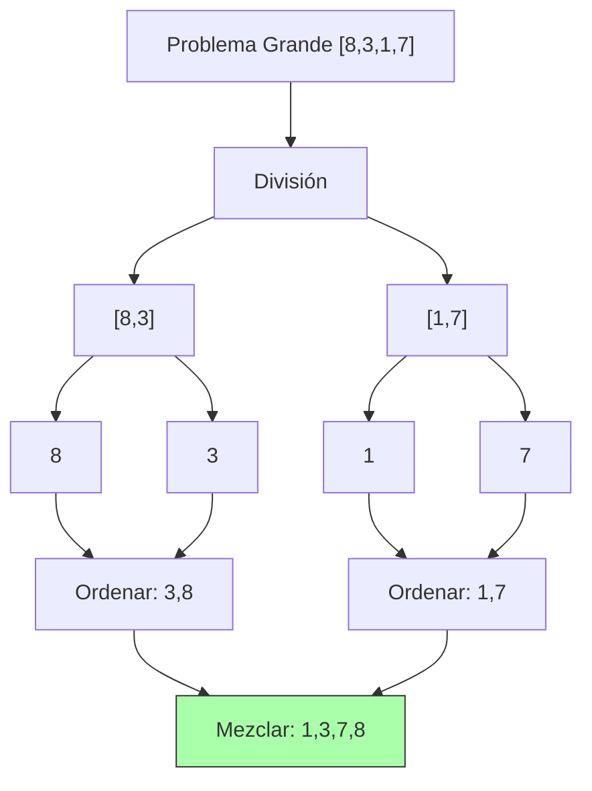
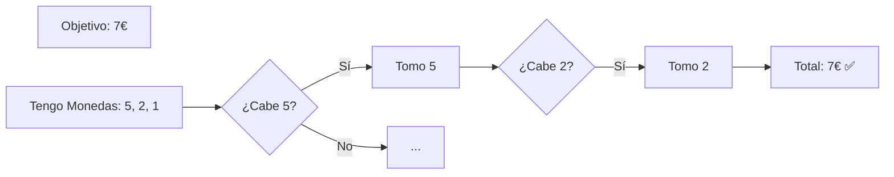
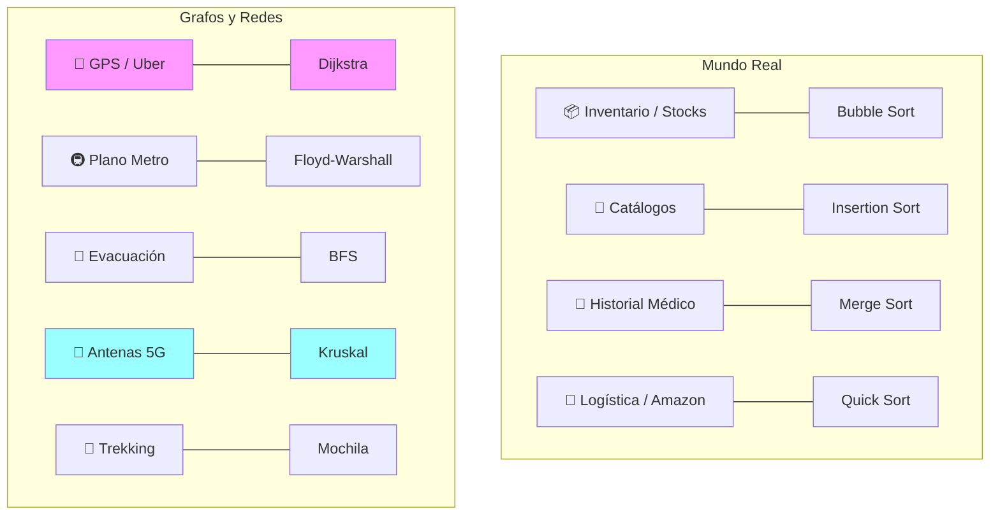

# Diseño de Algoritmos  🎨

> [!abstract] Objetivo Visual
> Asociar cada familia de algoritmos con una **forma** o **movimiento**.

---

## 1. Las 3 Estrategias Maestras 🧠

### A. Divide y Vencerás (Divide & Conquer) ⚔️

**Forma**: Un Árbol Invertido.
Rompes el problema hasta que es trivial, luego reconstruyes.

  

### B. Algoritmos Voraces (Greedy) 🍔

**Forma**: Una línea recta (sin mirar atrás).
Tomas la moneda más grande posible en cada paso.

### C. Programación Dinámica 💾

**Forma**: Una Tabla / Rejilla.
Vas rellenando huecos basándote en los huecos anteriores.

---

## 2. Mapa Visual de Casos de Uso (⚠️ Examen)

Asocia el icono con el algoritmo.

---

## 🎴 Flashcards Visuales

¿Qué forma tiene la estrategia "Divide y Vencerás"?::Un árbol que se ramifica y luego se une (como Merge Sort).

¿Qué visualización representa mejor a los algoritmos Voraces?::Comerse la pieza más grande disponible en cada paso (Pacman).

¿Si ves un mapa de Metro (todos conectados con todos), qué algoritmo es?::Floyd-Warshall.

¿Si ves antenas que hay que conectar con el mínimo cable posible?::Kruskal.

---

## 🔗 Referencias

- [[Resolución de Problemas]]
- [[Big O y Análisis de Complejidad]]
