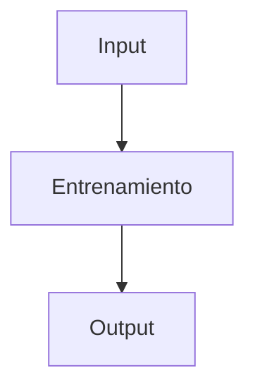

# Deep Learning Keras

**Objetivo:** Enteder que es Keras

## 📝 Definición

Keras es una librería de alto nivel que permite construir bloques para desarrollar modelos de deep learning.

 

Algunos de los bloques más destacados de Keras incluyen:

1. Capas: Keras proporciona una amplia gama de capas predefinidas que se pueden utilizar para construir redes neuronales, como capas densas, convolucionales, recurrentes y de agrupación.

2. Modelos: Con Keras, puedes construir modelos de deep learning utilizando un enfoque de programación orientada a objetos, donde puedes definir y conectar capas para crear arquitecturas complejas.

3. Funciones de activación: Keras ofrece una variedad de funciones de activación comunes utilizadas en redes neuronales, como ReLU, sigmoid y tanh, que pueden ser fácilmente aplicadas a las salidas de las capas.

4. Optimizadores: Keras incluye una variedad de algoritmos de optimización populares utilizados para entrenar modelos de deep learning, como SGD (Stochastic Gradient Descent), Adam y RMSprop.

5. Métricas: Keras proporciona métricas predefinidas que se pueden utilizar para evaluar el rendimiento del modelo durante el entrenamiento, como precisión, pérdida y F1-score.

En resumen, los bloques en Keras te permiten construir modelos de deep learning de manera eficiente y modular, lo que facilita la experimentación con diferentes arquitecturas y técnicas de optimización.

## 🔄 Flujo/Proceso



_💡 Editar diagrama según necesidad_

## 💻 Ejemplo Básico

```python
# Ejemplo de uso
```

## 🔗 Conceptos Relacionados

- [[Deep Learning]]
- [[Entrenamiento de la Red Neuronal]]

## 📝 Reflexiones

Keras es una API de alto nivel que esta dentro de TensorFlow.

## 🎴 Flashcards


¿Cuál es la diferencia entre Sequential y Functional API en Keras?::Sequential es lineal (una entrada, una salida), Functional permite arquitecturas complejas con múltiples entradas/salidas

¿Qué hace model.compile() en Keras?::Configura el proceso de entrenamiento: optimizer, función de pérdida y métricas

¿Para qué sirve el callback EarlyStopping?::Detiene el entrenamiento automáticamente cuando la métrica de validación deja de mejorar, evitando overfitting
<!--SR:!2025-07-17,1,230-->

---

**Tags**: #Deep Learning #conceptos #flashcards **Fecha**: 2025-07-16

