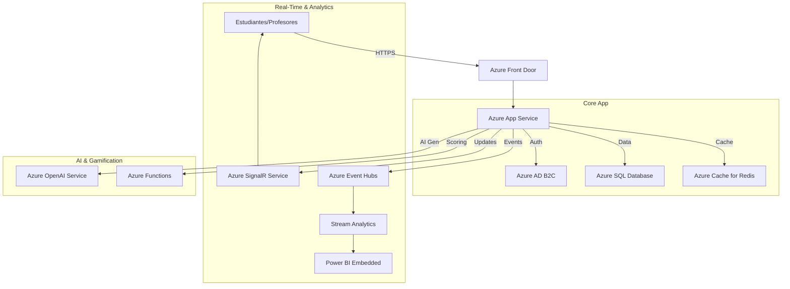

# Propuesta Técnica: Eduinnovatech on Azure ☁️

**Caso de Estudio**: Caso 1 - Eduinnovatech (Startup EdTech)
**Enfoque**: Moderno, Escalable y Gamificado (Azure)

---

## 1. Visión del Proyecto

Eduinnovatech no es solo un gestor de exámenes, es una plataforma de **alto rendimiento** para evaluaciones en tiempo real.

* **Problema**: Sistemas antiguos, lentos y sin feedback inmediato.
* **Solución**: Arquitectura reactiva en la nube (Event-Driven) que permite ver resultados *mientras* suceden.

---

## 2. Arquitectura Propuesta (Azure)

Utilizaremos una arquitectura **PaaS (Platform as a Service)** para minimizar el mantenimiento y maximizar la escalabilidad.

### Diagrama de Flujo (Mermaid)

### Componentes Clave

1. **Frontend/Backend**:
    * **Azure App Service (Web Apps)**: Para alojar la aplicación (FastAPI/Python o React). Escala automáticamente según el tráfico.
2. **Base de Datos**:
    * **Azure SQL Database**: Para datos relacionales (alumnos, cursos).
    * **Redis Cache**: Para que los exámenes carguen instantáneamente (baja latencia).
3. **Tiempo Real (La Joya de la Corona)**:
    * **Azure SignalR Service**: Para que los profesores vean las barras de progreso de los alumnos moverse *en vivo*. Esto diferencia a Eduinnovatech de un Moodle aburrido.
4. **Inteligencia Artificial**:
    * **Azure OpenAI**: Para generar preguntas de examen infinitas automáticamente a partir de un tema (ahorro de tiempo para profesores).

---

## 3. Estrategia de Adopción (Fases)

Para una startup, no podemos gastar todo el dinero el día 1.

### Fase 1: MVP (Minimum Viable Product)

* **Objetivo**: Validar con 1 colegio.
* **Infra**: 1 App Service (Plan Básico), 1 SQL Database (DTU básico).
* **Costo**: < $50/mes (o Gratis con Azure for Students).

### Fase 2: Escalamiento Nacional

* **Objetivo**: 50 colegios + Padres entrando a ver notas.
* **Upgrade**: Activar **Auto-scaling** en App Service. Añadir **Redis** para caché.
* **Feature**: Añadir dashboards para padres.

### Fase 3: "Olimpiadas" y Gamificación Masiva

* **Objetivo**: Competiciones entre colegios en tiempo real.
* **Upgrade**: **Azure Front Door** para balanceo de carga global. **SignalR** a máxima capacidad para miles de conexiones simultáneas.

---

## 4. Justificación ¿Por qué Nube?

1. **Elasticidad para Exámenes**: Los colegios tienen picos de tráfico bestiales a las 9:00 AM (hora del examen) y nada a las 4:00 AM.
    * *On-Premise*: Tendrías que pagar servidores para el pico máximo (carísimo).
    * *Cloud*: Pagas solo por lo que usas. Se apaga solo por la noche.
2. **Seguridad (Menores de Edad)**: Al tratar datos de niños, Azure ofrece cumplimiento normativo (GDPR) y seguridad de grado militar (Azure AD) "out of the box".
3. **Innovación Rápida**: Podemos conectar Inteligencia Artificial (Azure OpenAI) en minutos para corregir exámenes abiertos, algo imposible en un servidor local antiguo.
