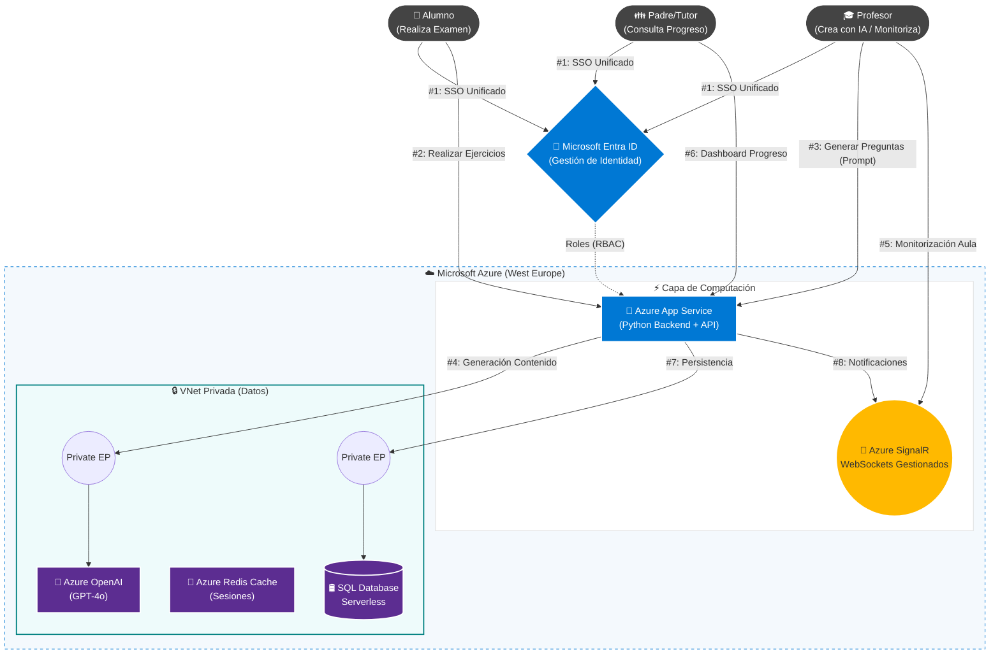

# Memoria Técnica del Proyecto: EduInnovatech

**Versión:** 3.0 (Release Candidate)
**Tipo:** Plataforma SaaS Educativa & Olimpiada Interescolar
**Arquitectura:** Cloud Native en Microsoft Azure (PaaS & Serverless)

---

## 1. Visión General y Objetivos

**EduInnovatech** nace con la misión de democratizar la tecnología educativa de alto rendimiento. El proyecto no es solo una herramienta de evaluación, sino un ecosistema integral que conecta a **Alumnos, Profesores y Familias** en un entorno seguro y escalable.

### 1.1. El Reto de la Dualidad Operativa

El sistema debe resolver dos escenarios de carga diametralmente opuestos utilizando la misma infraestructura para garantizar la viabilidad económica:

1. **Modo "Jornada Escolar" (Uso Continuo):**
    * **Horario:** Lunes a Viernes, 08:00 - 17:00.
    * **Actividad:** Tráfico constante pero moderado. Creación de contenido asistida por IA, realización de deberes y consulta de notas por parte de los padres.
2. **Modo "Olimpiada Interescolar" (Evento Masivo):**
    * **Horario:** Ventanas puntuales (ej: 2 horas al trimestre).
    * **Actividad:** Picos de concurrencia extrema (50.000 alumnos simultáneos) compitiendo en tiempo real entre múltiples centros educativos.

---

## 2. Arquitectura de la Solución

La solución implementa una arquitectura **Hub-and-Spoke** en la nube de Microsoft Azure, priorizando servicios gestionados (PaaS) y modelos de pago por uso (Serverless).

### 2.1. Diagrama de Componentes (Nivel Lógico)

### 2.2. Descripción de Componentes Clave

| Componente | Servicio Azure | Función Crítica |
| --- | --- | --- |
| **Backend** | Azure App Service (Linux) | Ejecuta la lógica de negocio en Python. Escala horizontalmente (más instancias) durante la Olimpiada. |
| **Tiempo Real** | **Azure SignalR Service** | Gestiona miles de conexiones WebSocket simultáneas. Permite a los profesores ver el progreso de los alumnos en vivo sin saturar el servidor web. |
| **Base de Datos** | **SQL Database Serverless** | El corazón del ahorro. Se pausa o reduce al mínimo por las noches y escala a 40-80 vCores durante el examen automáticamente. |
| **Caché** | Azure Redis Cache | Almacena el estado temporal del examen (ej: pregunta actual) para reducir la latencia y descargar la base de datos SQL. |
| **IA** | Azure OpenAI Service | Motor de generación de preguntas y corrección automática. Desplegado en red privada para garantizar la privacidad. |

---

## 3. Justificación Tecnológica y Económica (FinOps)

La elección de Azure frente a AWS o Google Cloud se fundamenta en la **adaptabilidad al ciclo escolar**.

### 3.1. Modelo de Costes Dinámico

La competencia obliga a provisionar recursos fijos (pagar por la capacidad máxima las 24h). Nuestra arquitectura Azure Serverless paga solo por la demanda real:

* **Fase Nocturna (19:00 - 07:00):** Tráfico nulo. SQL Serverless se pausa. **Coste: ~0€/hora**.
* **Fase Diaria (08:00 - 17:00):** Tráfico medio (Clases). SQL escala a 2 vCores. **Coste: ~0.5€/hora**.
* **Fase Evento (Olimpiada):** Tráfico crítico. SQL escala a 40 vCores. **Coste: ~10€/hora (solo durante 2h)**.

> **Resultado:** Un coste mensual estimado de **~75€** frente a los **>280€** que costaría mantener una infraestructura equivalente en AWS RDS o Google Cloud SQL.

### 3.2. Integración B2B (Colegios)

El uso de **Microsoft Entra ID** elimina la barrera de entrada. Los 50.000 alumnos acceden con su cuenta de *Microsoft 365 Education* del colegio. No gestionamos contraseñas, reducimos riesgos de seguridad y facilitamos el despliegue en nuevos centros.

---

## 4. Seguridad, Privacidad y RGPD

El tratamiento de datos de menores es el requisito no funcional más estricto del sistema.

### 4.1. Estrategia de Defensa en Profundidad

1. **Identidad (RBAC):** Implementación de control de acceso basado en roles.

* *Padres:* Solo pueden ver los registros (Row-Level Security) asociados al ID de su hijo.
* *Profesores:* Acceso a datos agregados de su clase, pero no de otros colegios.

1. **Aislamiento de Red (VNet Integration):**

* La Base de Datos y el servicio OpenAI **NO tienen acceso público**.
* La comunicación Backend-Datos viaja por la red troncal de Azure mediante **Private Endpoints**, invisible a internet.

1. **Protección de IA:** Contrato Enterprise con Microsoft que garantiza que los datos de entrada (exámenes, respuestas de alumnos) **no se utilizan para entrenar modelos públicos**.

---

## 5. Inteligencia Artificial como Herramienta Docente

Integramos **GPT-4o mini** no como un "chat", sino como un motor de productividad invisible integrado en el flujo de trabajo del profesor.

* **Generación de Contenido:** El profesor sube un PDF con el temario y solicita: *"Crea 10 preguntas de opción múltiple dificultad media"*.
* **Corrección Semántica:** La IA evalúa respuestas abiertas de los alumnos, sugiriendo una nota y una explicación pedagógica, que el profesor debe validar.

---

## 6. Conclusión

**EduInnovatech** demuestra que una arquitectura **Cloud Native** bien diseñada permite a una startup ofrecer servicios de nivel empresarial. Al combinar la potencia de **Azure SignalR** para la experiencia en tiempo real, la seguridad de **Entra ID** para la gestión de usuarios y la elasticidad de **SQL Serverless** para los costes, hemos creado una plataforma sostenible, segura y preparada para el futuro de la educación digital.
