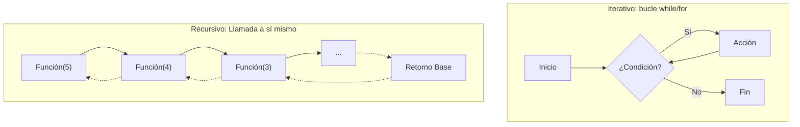
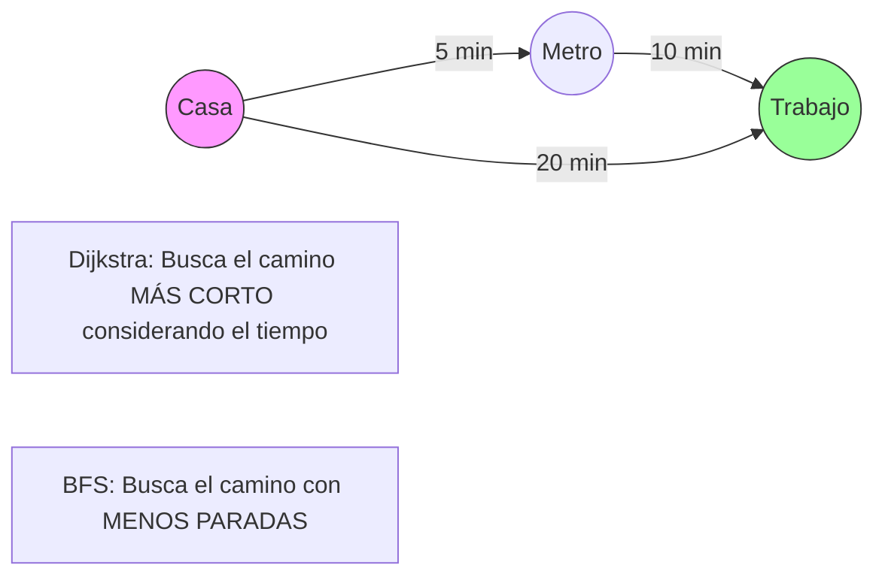
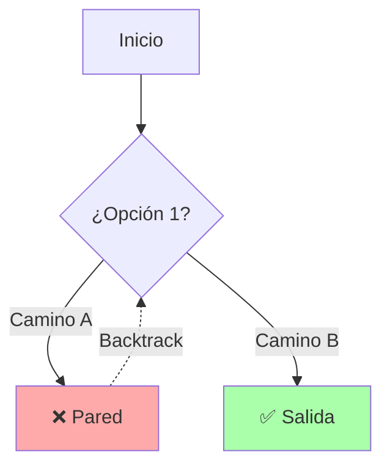
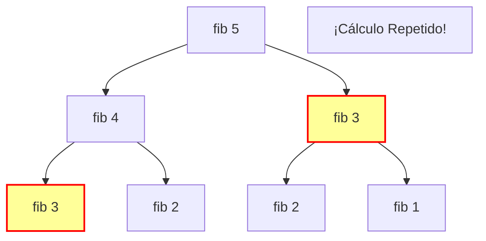

# Resolución de Problemas 🎨

> [!abstract] Objetivo Visual
> Entender *cómo se mueve* el algoritmo. No memorices código, visualiza el flujo.

## 1. Recursividad vs Iteración 🔄

### Visualizando el Stack (Pila de Llamadas)

Cuando usas recursividad, el ordenador apila tareas pendientes. Esto consume memoria.

## 2. Grafos: Los 4 Fantásticos 🕸️

Visualiza para qué sirve cada uno en el mapa de una ciudad.

### Tabla Visual de Algoritmos

| Algoritmo | Mentalidad | Visualización |
| :--- | :--- | :--- |
| **Dijkstra** | ⚡ **El Prisa-Matas** | Expande ondas desde el origen. Elige siempre el nodo más cercano. |
| **Floyd-Warshall** | 🧠 **El Omnisciente** | Calcula una **Matriz Gigante**. Sabe la distancia de todos a todos. |
| **BFS** (Amplitud) | 🌊 **La Mancha de Aceite** | Se expande capa por capa (Vecinos -> Vecinos de vecinos). |
| **Kruskal** | 💰 **El Tacaño** | Ordena cables por precio (baratos primero). Conecta islas hasta tener todo unido. |

## 3. Backtracking (Vuelta Atrás) 🔙

Imagina un laberinto. Pruebas un camino, te chocas, y vuelves al último cruce.

## 4. Programación Dinámica 💾

### El Árbol de Fibonacci (El Problema)

Sin Dynamic Programming, calculas `fib(2)` millones de veces.

### La Solución (Memorización)

Guardamos el resultado la primera vez. La segunda vez es instantáneo.

## 🎴 Flashcards Visuales

¿Qué forma tiene la expansión de un BFS?::Como ondas en el agua (círculos concéntricos).

¿Qué estructura visualiza mejor la Recursividad?::Una Pila (Stack) de platos apilados.

¿Qué hace Kruskal visualmente?::Une "islas" de nodos usando las aristas más baratas posibles.

