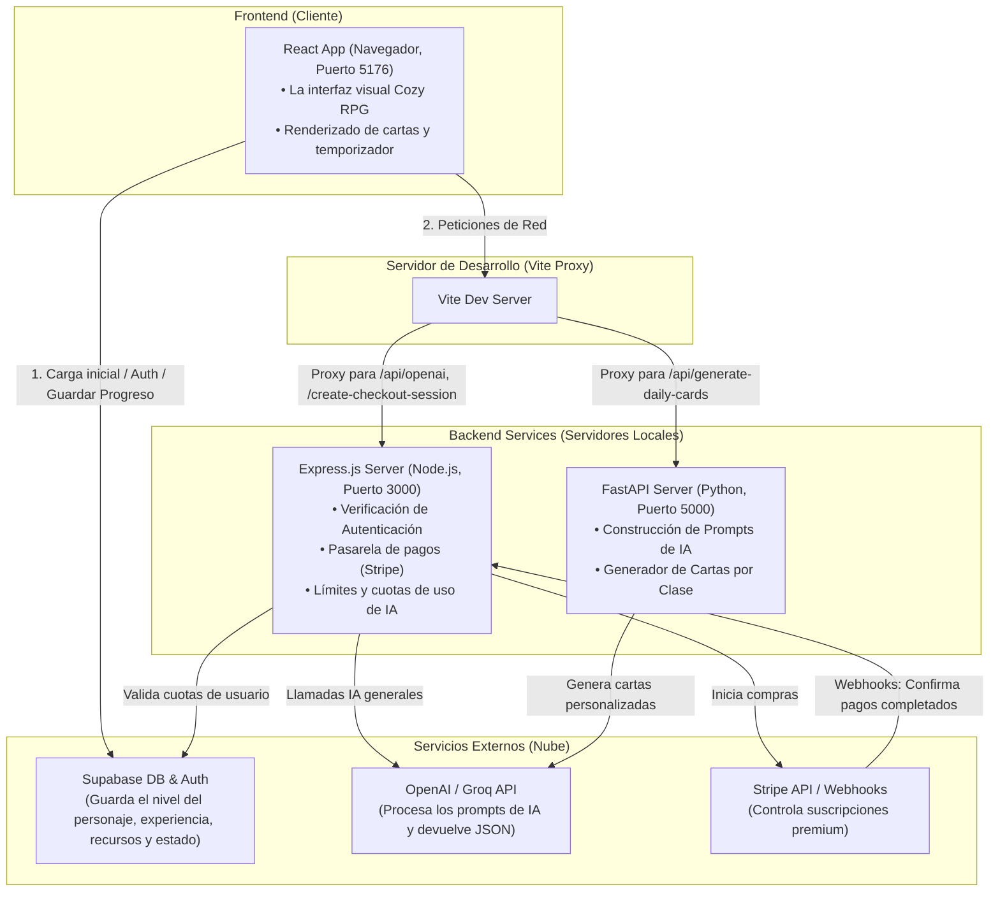

## 1. El Mapa de la Aplicación (La Arquitectura)

La aplicación está dividida en cuatro bloques principales. Tres de ellos corren en tu máquina local durante el desarrollo y uno es externo:



### A. El Frontend (React + Vite) — *El Comedor del Restaurante*
*   **React** es una biblioteca de JavaScript. En Python/FastAPI, si quieres mostrar algo dinámico, sueles usar plantillas (como Jinja2) que se procesan en el servidor y envían HTML estático. En React es al revés: el servidor le manda al navegador un archivo JavaScript vacío y el navegador del usuario se encarga de dibujar y actualizar la pantalla en tiempo real. 
*   **Vite** es la herramienta que compila todo ese código del frontend ultra rápido para que el navegador lo entienda.
*   **Tailwind CSS** es el framework para darle los estilos visuales (colores, bordes redondeados tipo "cristal de mar", animaciones).

### B. El Servidor de IA (FastAPI + Uvicorn) — *La Cocina de Hechizos (Python)*
¡Aquí está tu zona de confort! En la carpeta `/ai_engine` hay un servidor FastAPI. 
*   Usa **Pydantic** para validar los datos que recibe del cliente (como la clase del personaje y su energía).
*   Se conecta a la API de OpenAI (o Groq) usando la clave secreta guardada en el archivo `.env`.
*   Su única misión es armar prompts temáticos de rol (ej. "Eres un Game Master y necesitas crear 3 cartas para un *Guerrero* de nivel 3...") y formatear la respuesta del modelo de IA como un JSON limpio.

### C. El Servidor de Control (Node.js + Express) — *La Caja Registradora*
En la carpeta `/server` hay un servidor escrito en Node.js (JavaScript de servidor) con Express (que es el equivalente a FastAPI en el mundo de Node).
*   Se encarga de verificar que el usuario tenga sesión iniciada mediante tokens de Supabase.
*   Mide cuántas veces al mes el usuario ha usado la IA para no sobrepasar los límites de tu API Key.
*   Se comunica con **Stripe** para cuando un usuario decide pagar la versión premium.

### D. Base de Datos y Autenticación (Supabase) — *El Almacén*
*   **Supabase** es un servicio en la nube que te da una base de datos PostgreSQL y un sistema de login listos para usar. El frontend se comunica directamente con él para saber cosas como: *"¿Cuánta madera tiene este usuario?"* o *"¿Qué nivel tiene su personaje?"*.

---

## 2. La Red de Comunicación (El truco del Proxy de Vite)

Como desarrollador de FastAPI, sabrás que cuando intentas llamar desde un puerto (ej. el frontend en el `5176`) a otro puerto (ej. FastAPI en el `5000`), el navegador bloquea la petición por seguridad (CORS).

Para evitar esto, **Vite** actúa como un intermediario o "Proxy". En el archivo [vite.config.ts](file:///workspaces/InnerLevelAPP/vite.config.ts) está configurado esto:

```typescript
server: {
  proxy: {
    '/api/generate-daily-cards': {
      target: 'http://localhost:5000', // Redirige a FastAPI (Python)
      changeOrigin: true,
    },
    '/api/openai': {
      target: 'http://localhost:3000', // Redirige a Express (Node.js)
      changeOrigin: true,
    }
  }
}
```

Cuando el frontend llama a `/api/generate-daily-cards`, cree que se lo está pidiendo a sí mismo. Pero en silencio, Vite toma esa petición y se la envía a tu servidor FastAPI en el puerto 5000. ¡Así se resuelven los problemas de CORS en desarrollo!

---

## 3. El Core Loop: Paso a paso de una Petición de IA

Vamos a trazar qué ocurre cuando el usuario entra en **El Bosque del Enfoque** y pide generar sus cartas del día:

1. **El Frontend envía los datos**:
   En React, obtenemos el estado del personaje actual desde el contexto global (`AppContext.tsx`). Mandamos una petición HTTP `POST` a `/api/generate-daily-cards` llevando este JSON:
   ```json
   {
     "character": {
       "class": "Sage",
       "level": 2,
       "energy": { "current": 80, "maximum": 100 }
     },
     "availableTime": 2.5
   }
   ```

2. **FastAPI recibe y valida**:
   En tu archivo [ai_engine/main.py](file:///workspaces/InnerLevelAPP/ai_engine/main.py#L64-L86), el endpoint `@app.post("/api/generate-daily-cards")` recibe este cuerpo y lo mapea automáticamente a una clase Pydantic llamada `UserContext` definida en [models.py](file:///workspaces/InnerLevelAPP/ai_engine/models.py#L18-L20).

3. **Se crea el Prompt (La Receta)**:
   FastAPI llama a `build_daily_cards_prompt(request)` en [prompt_builder.py](file:///workspaces/InnerLevelAPP/ai_engine/services/prompt_builder.py#L13-L116). Este script toma los datos del personaje y monta un prompt gigante en inglés pidiéndole al modelo de lenguaje (como Llama 3.1) que genere **exactamente 3 cartas RPG Cozy** en formato JSON.

4. **Llamada a la IA**:
   El servidor de FastAPI hace la llamada HTTP a OpenAI/Groq y recibe una respuesta de texto que contiene el JSON con las cartas (por ejemplo: *"Mind Palace Construction"*, *"Sage's Meditation Circle"*).

5. **El Frontend renderiza**:
   FastAPI responde el JSON de vuelta al navegador. React recibe las cartas, actualiza su estado interno y (gracias a su reactividad) dibuja inmediatamente las tarjetas en pantalla con hermosos efectos visuales de cristal de mar y animaciones de carga.

---
