# 📅 Sábado 17: 🌊 Modo Flow

> [!quote] Cita
> "La generosidad hacia el futuro es darlo todo al presente." — Camus

## 🧠 Estado del Sistema
> [!success] 🟢 Batería Alta
> **Sueño:** 2/2 | **Energía:** 2/2
> **Objetivo:** `Fundamentos DS`

```mermaid
gantt
    title Tu Horario de Hoy
    dateFormat HH:mm
    axisFormat %H:%M
    section Mañana
    Lectura Camus        :done, 08:00, 1h
    ARQUITECTURA (Duro)  :active, 09:00, 2h
    ALGORITMOS           :11:30, 2h
    section Vida
    Surf y Escalar       :active, 09:00, 4h
    Comida               :14:00, 2h
    Proyecto App         :crit, 16:00, 3h
```

---

## 🌞 Mañana: Roca Dura (09:00 - 13:30)

### 🐸 Arquitectura de Computadores
*Meta: Crear notas atómicas en [[Arquitectura_Computadores_MOC]]*
- [x] Revisar temas marcados con ❓ ✅ 2026-01-17
- [ ] Concepto clave de hoy: 

### 🧮 Algoritmos
- [ ] 1h Teoría + 1h Práctica ([[Algoritmos_MOC]])

---

## 🚀 Proyecto Personal
- [ ] Revisar Roadmap
- [ ] Implementar mejora App

---

## 📉 Cierre del Día (Dataview)
*Rellenar al finalizar el día*

| Métrica | Input |
| :--- | :--- |
| **Horas Deep Work** | [horas-deep-work:: 0] |
| **Concentración** | [nivel-concentracion:: 0] / 10 |

**Hábitos:**
- [ ] 📚 Camus [habito-lectura:: true]
- [ ] 🏋️‍♀️ Deporte [habito-deporte:: true]
- [ ] 💻 Código [habito-codigo:: true]